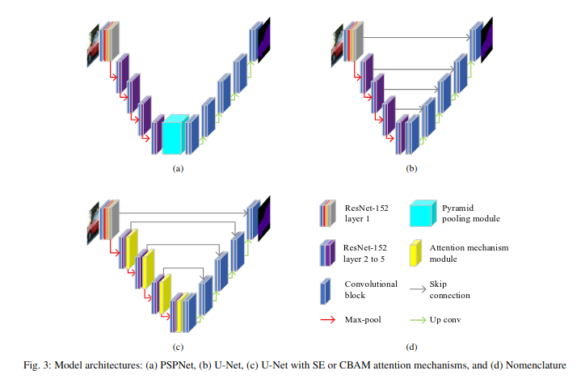

# SAR Nets — Evaluation Script (`run_own_pth_ssrr.py`)


This GitHub evaluates four semantic segmentation models in Search-and-Rescue (SAR) scenarios obtained from ground vehicles. Two base models are used (U-Net and PSPNet) to compare different approaches to semantic segmentation, such as skip connections between encoder and decoder stages and using a pooling pyramid module. The best base model is modified by including two attention mechanisms to analyze their performance and computational cost. We conduct a quantitative and qualitative evaluation using our SAR dataset defining eleven classes in disaster scenarios. The results demonstrate that the attention mechanisms increase model performance while minimally affecting the computation time.

---

## Figures




---

## 1) Download the Dataset

Download the SAR dataset from:

https://uma365-my.sharepoint.com/:f:/g/personal/061994342x_uma_es/IgBOYbIODX_STamGZKBkqivKAacX2K4TKoQoEIxa5NpcY1E?e=30oDyz

After downloading, keep the original folder structure. You will later pass the dataset root path to `--data_dir`.

---

## 2) Download the Model Weights

Download the model checkpoints (`.pth`) from:

https://uma365-my.sharepoint.com/:f:/g/personal/061994342x_uma_es/IgBfTpGP5zk-QqAvWdQ1cg6ZAb4WEswD_kcQErWZPG67ZzE?e=C6GRkq

Place the weights in a convenient directory and pass their path via `--file_name` (and optionally `--model_dir`).

---

## 3) Run the Evaluation Script

Use the script `run_own_pth_ssrr.py` to evaluate a model using a selected checkpoint.

### Minimal example

```bash
python run_own_pth_ssrr.py \
  --model_name unet \
  --weight_name checkpoint_UNet \
  --file_name /path/to/checkpoint_of_the_model.pth \
  --dataset_split test \
  --n_class 12 \
  --data_dir /path/to/dataset_root \
  --model_dir /path/to/models_or_weights_dir
```

> Replace the values with the model and checkpoint you want to test. Available model names can be found in the `/model` folder.

---

## 4) Script Arguments (Important)

The main arguments to modify are:

- `--model_name` (`-m`): name of the model to evaluate (see the `/model` folder).
- `--weight_name` (`-w`): descriptive name for the weight/checkpoint.
- `--file_name` (`-f`): full path to the `.pth` checkpoint file (e.g., `./checkpoint_of_the_model.pth`).
- `--dataset_split` (`-d`): dataset split selection.

### Dataset split file requirement (`--dataset_split`)
For `--dataset_split`, you must create a `.txt` file **inside your dataset folder** listing the images you want to evaluate.  
This list is used to generate colored ground-truth outputs for the selected images.

**Example (inside the dataset root):**
```
test.txt
```

**Example contents of `test.txt` (one image per line):**
```
000001.png
000002.png
000003.png
```

- `--n_class` (`-nc`): number of classes (default: `12`).
- `--data_dir` (`-dr`): path where the dataset is stored.
- `--model_dir` (`-wd`): path where the model/weights are stored.

---

## 5) Citation

If you use this code or dataset in your research, please cite:

```bibtex
@INPROCEEDINGS{10499929,
  author={Salas-Espinales, Andrés and Vázquez-Martín, Ricardo and García-Cerezo, Alfonso and Mandow, Anthony},
  booktitle={2023 IEEE International Symposium on Safety, Security, and Rescue Robotics (SSRR)},
  title={SAR Nets: An Evaluation of Semantic Segmentation Networks with Attention Mechanisms for Search and Rescue Scenes},
  year={2023},
  pages={139-144},
  keywords={Visualization;Computational modeling;Semantic segmentation;Disasters;Time measurement;Land vehicles;Decoding;Deep Learning;Semantic Segmentation;Attention Mechanism;Disaster Robotics},
  doi={10.1109/SSRR59696.2023.10499929}
}
```
